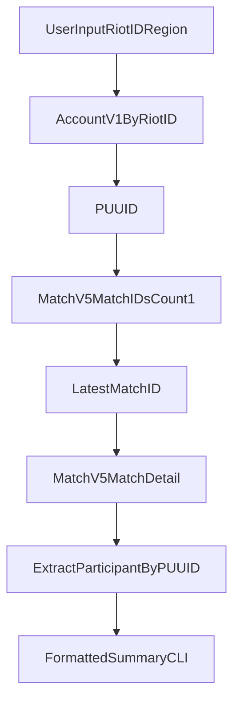

# Simple League of Legends CLI Stat Checker

Simple League of Legends CLI Stat Checker is a one-day Python project that uses Riot's APIs to fetch a player's **most recent League of Legends match** and print a clean summary in the terminal.

## What It Shows

- Riot ID and resolved region/platform
- Win/Loss result
- Champion played
- K/D/A and KDA
- CS and CS per minute
- Damage dealt and taken
- Match duration and queue type

## Tech Stack

- Python 3.10+
- Riot APIs (`account-v1`, `summoner-v4`, `match-v5`)
- `requests`
- `python-dotenv`
- `pytest` (small tests)

## Setup

1. Clone the repo and enter it:

```bash
git clone <your-repo-url>
cd simple-league-of-legends-cli-stat-checker
```

2. Create and activate virtual environment:

```bash
python -m venv .venv
# Windows PowerShell
.venv\Scripts\Activate.ps1
```

3. Install dependencies:

```bash
pip install -r requirements.txt
```

4. Add your Riot API key:

```bash
copy .env.example .env
```

Then edit `.env` and set:

```env
RIOT_API_KEY=RGAPI-your-key-here
```

## Usage

Basic run:

```bash
python -m src.main "GameName#TagLine" --region euw
```

Verbose run:

```bash
python -m src.main "GameName#TagLine" --region euw --verbose
```

Explicit routing + platform override:

```bash
python -m src.main "GameName#TagLine" --region europe --platform euw1
```

## Region Notes

You can pass either:
- platform shorthand: `euw`, `na`, `kr`, `eune`, `br`, `lan`, `las`, `oce`
- full platform: `euw1`, `na1`, `kr`, etc.
- routing region: `europe`, `americas`, `asia`, `sea`

If you pass only routing region, a default platform is used (`euw1`, `na1`, `kr`, `oc1`).

## Example Output

```text
=== Simple League of Legends CLI Stat Checker: Latest Match ===
Riot ID: Faker#KR1
Region: asia | Platform: kr
Match: KR_1234567890 (Ranked Solo/Duo)
Result: WIN
Champion: Ahri
K/D/A: 9/2/7 (KDA: 8.0)
CS: 287 (9.1/min)
Damage: dealt 28,501 | taken 14,220
Duration: 31:22
```

## Error Handling

The app returns clear errors for:
- Missing API key
- Invalid Riot ID format
- Not found / wrong region
- Rate limiting
- Invalid/expired API key

## Testing

Run:

```bash
pytest -q
```

## Architecture


